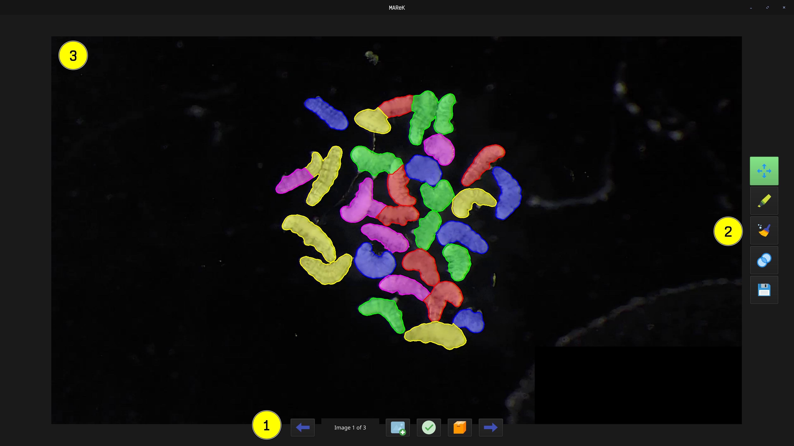

# User guide

## App preview

<!--  -->

## 1. File manipulation

- ⬅️/➡️ — switching images
- 📁 – open new images + annotations
    - only .zip folders are visible
    - annotations (.npz) have to be in same folder as images
- ✅ – sets the currently opened annotations as *__validated__* (images and annotations will have *_validated* suffix in filesystem)
- 📦 – exports all validated annotations to selected destination

## 2. Tools

Switching tools by left clicking. Current tools is highlighted with green color.

- ✋ – moving the image
- ✏️ – drawing boundaries
- 🧹 – removing annotations
- 🔵 – merging objects
- 💾 – saving changes to the labels file

## 3. Canvas

Here is displayed currently opened image with its annotation. You can zoom in with mouse wheel.
